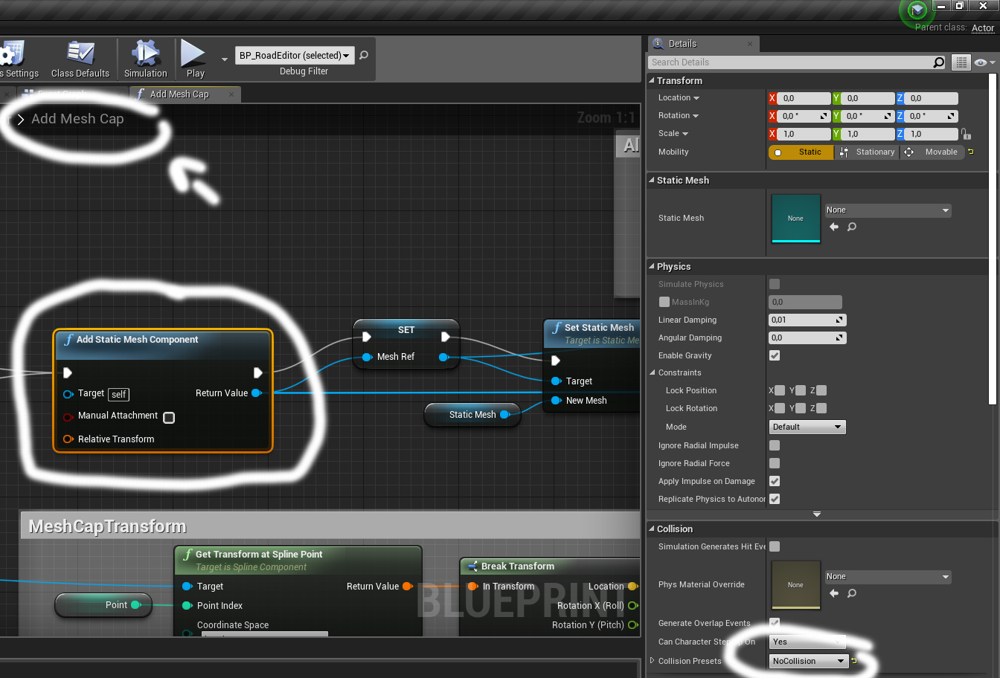
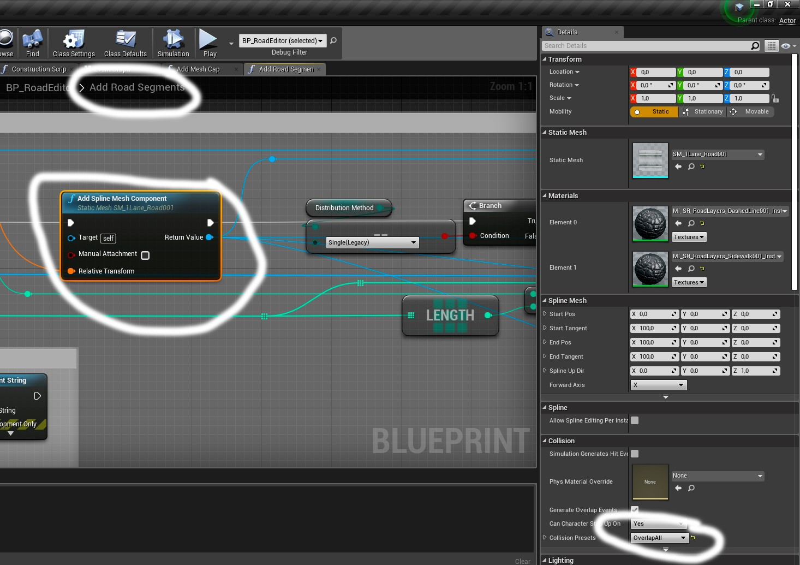

# Fix-Documentation-SnappyRoads-
Hi! This is not my Blueprint Solution and I do not consider this Snappy Roads as an update, I will just show how to fix the problems of this Snappy Roads.

SPLINE

Array SplineMeshes - This is a variable that contains statiс meshes of roads. When you add a second element , assign it and then go to (Distribution Method) and select type (Any): Random. Result : you will see that the Spline you have assigned in the second static mesh is randomly scattered throughout the spline.

float XScale , float YScale - Scales the road by X and Y

float MaxDrawDistance - Draw distance camera

bool CastShadow - Cast Shadow for Rendering 

## FIX COLLISION PRESET

name CollisionPreset - Collision Roads. You can change this variable by calling it "BlockAll" or delete this variable , but fix blueprints:

WARNING This variable is responsible for the collision of the road. If in function AddCapMesh put "BlockAll" and in function AddRoadsSegments put "OverlapAll" then roads will not join among themselves

Select BlockAll (to AddStaticMesh , to AddSplineMesh)

