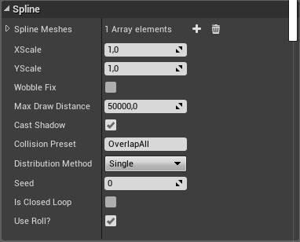

# Fix-Documentation-SnappyRoads-
Hi! This is not my Blueprint Solution and I do not consider this Snappy Roads as an update, I will just show how to fix the problems of this Snappy Roads.

SPLINE

Array SplineMeshes - This is a variable that contains statiс meshes of roads. When you add a second element , assign it and then go to (Distribution Method) and select type (Any): Random. Result : you will see that the Spline you have assigned in the second static mesh is randomly scattered throughout the spline.

float XScale , float YScale - Scales the road by X and Y
